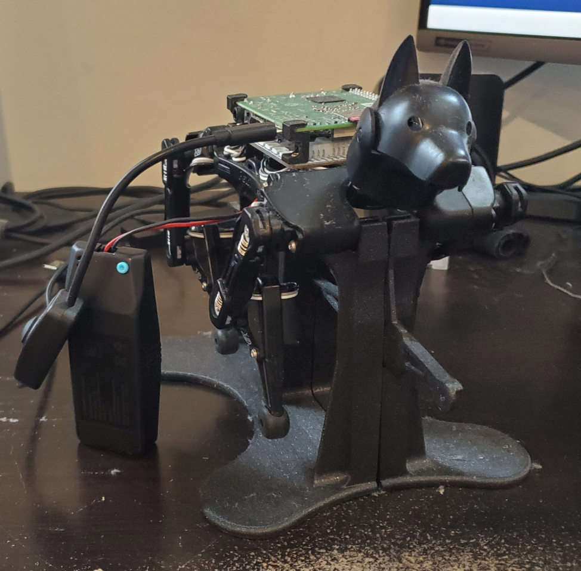
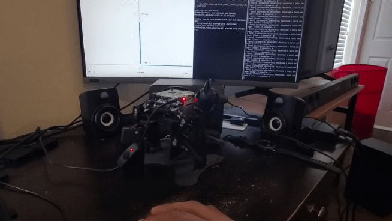

# Bittle-Ros-Suite

I'm creating this repo to develop my C++ and ROS skillset with a robotic quadruped robot. It's meant to be a "suite" of drivers I create for different functions (i.e movement, camera, groove sensors, etc.).

## Petoi Bittle

Petoi Bittle is an [open source robot dog](https://www.petoi.com/pages/bittle-open-source-bionic-robot-dog). I bought and assembled one in 2020 to get more embedded design/tinkering experience. Years later, I am here finally writing drivers for it. Better late than never!

## ROS
Otherwise known as [Robot Operating System](https://www.ros.org/), ROS helps me simplify the interface between a raspberry pi and the micro-controller for the Bittle robot, allowing me to:

- Run a main ROS server on my laptop, and remotely connect to the raspberry pi ROS node.
- send velocity and other commands to the raspberry pi, and have the pi connect with the Bittle micro-controller through a serial connection

This is what Spark (my Bittle robot) looks like:

The standoffs for the raspberry pi and the mount for the robot can be found from Petoi Bittle's [GitHub](https://github.com/PetoiCamp/NonCodeFiles/tree/master/stl) page.

## Dependencies and Usage

Besides having the robot and raspberry pi 3A, you'll need to install ROS (I'm using Noetic) on both the pi and the machine you'll send the commands from. Once that's done and you went through the fun serial connection setup from the [Petoi docs](https://docs.petoi.com/api/serial-protocol), you'll just need to download and build this repo as a package in your catkin workspace, and do the same for the [serial](https://github.com/wjwwood/serial) package since that's needed to connect to the robot. Then, roslaunch `teleop_server.launch` on the commanding machine and `teleop_remote.launch` on the pi, and use the rqt_remote to send commands. 

Here is an example of Spark moving through teleop commands:

## Contributors
I worked on this repo myself, however a major thanks to Rongzhong Li for helping me set up andn calibrate the robot properly, and to Dmitry Maslov for helping me set up ROS on the raspberry pi and setting it up with [his Bittle driver written in python](https://github.com/AIWintermuteAI/bittle_ROS), which I used as a baseline for recontructing the base movement driver in C++
